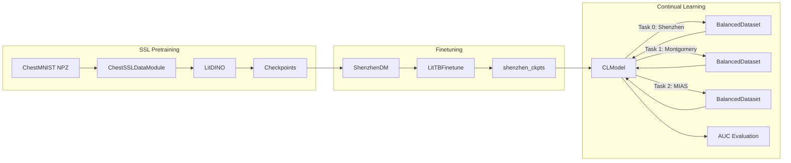

# Project Architecture
This document outlines the high-level design and data flow of the Continual
SSL→CL pipeline for chest radiograph classification.
## 1. Overall Workflow

```mermaid
flowchart LR
 subgraph SSL Pretraining
 A[ChestMNIST NPZ] --> B[ChestSSLDataModule]
 B --> C[LitDINO]
 C --> D[Checkpoints]
 end
 subgraph Finetuning
 D --> E[ShenzhenDM]
 E --> F[LitTBFinetune]
 F --> G[shenzhen_ckpts]
 end
 subgraph Continual Learning
 G --> H[CLModel]
 H -->|Task 0: Shenzhen| I[BalancedDataset]
 H -->|Task 1: Montgomery| J[BalancedDataset]
 H -->|Task 2: MIAS| K[BalancedDataset]
 I --> H
 J --> H
 K --> H
 H --> L[AUC Evaluation]
 end
```
