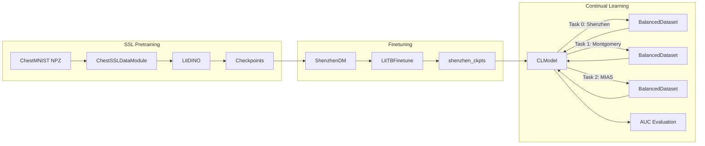

# File: docs/architecture.md


# Project Architecture

This document outlines the high-level design and data flow of the Continual SSL→CL pipeline for chest radiograph classification.

## 1. Overall Workflow



## 2. Module Breakdown

* **src/transforms.py**: Contains `med_transform_ssl` and `DinoTransform` for image preprocessing.
* **src/datasets.py**: Defines `ChestNpz`, `ChestNpzSSL`, `ShenzhenCSV`, `CXRCSV`, and `MIASCSV`.
* **src/datamodules.py**: Implements `ChestSSLDataModule` and `ShenzhenDM`, orchestrating PyTorch Lightning data loading.
* **src/models/dino.py**: Implements `DinoLoss` and `LitDINO` with student/teacher ViT-Tiny architectures.
* **src/models/finetune.py**: Defines `LitTBFinetune` for supervised finetuning on Shenzhen.
* **src/models/continual.py**: Contains `CLModel` and `BalancedDataset` implementing replay + EWC.
* **src/utils.py**: Utility functions (`BatchProgressCallback`, `compute_auc`) for progress and evaluation.

## 3. Key Components

### 3.1 DINO Loss & Teacher Momentum

* **Centering**: Softmax sharpening of teacher outputs with EMA center update to avoid collapse.
* **Momentum Update**: Teacher parameters updated via EMA of student parameters (momentum = 0.996).

### 3.2 Finetuning Strategy

* **Freeze Schedule**: Encoder frozen for initial `freeze_epochs`, then entire network fine-tuned.
* **Metric**: Binary AUROC tracked on validation set, with `EarlyStopping` and `ModelCheckpoint`.

### 3.3 Continual Learning Mechanics

1. **Replay Buffer**: Random sampling of past tasks up to `mem_size` (200) stored in memory.
2. **Elastic Weight Consolidation (EWC)**: Fisher information estimated after each task; penalty applied to prevent forgetting.
3. **BalancedDataset**: Interleaves current task data and replay data; optional oversampling for class balance.

## 4. Data Flow

1. **Pretraining**: ChestMNIST images loaded → two augmented views → DINO training → checkpoints.
2. **Finetuning**: Load SSL checkpoint → train classification head on Shenzhen → save best checkpoint.
3. **Continual Phases**:

   * Load SSL checkpoint → Task 0 (Shenzhen) → compute Fisher & fill replay → Task 1 (Montgomery) → repeat → Task 2 (MIAS).

## 5. Evaluation

* After each phase, compute AUROC on current and previous tasks to measure forward & backward transfer.

## 6. Extensions

* Additional datasets can be plugged in by implementing new `CSV` loaders and adding config entries.
* Hyperparameters and schedules are fully configurable via YAML files.

```
